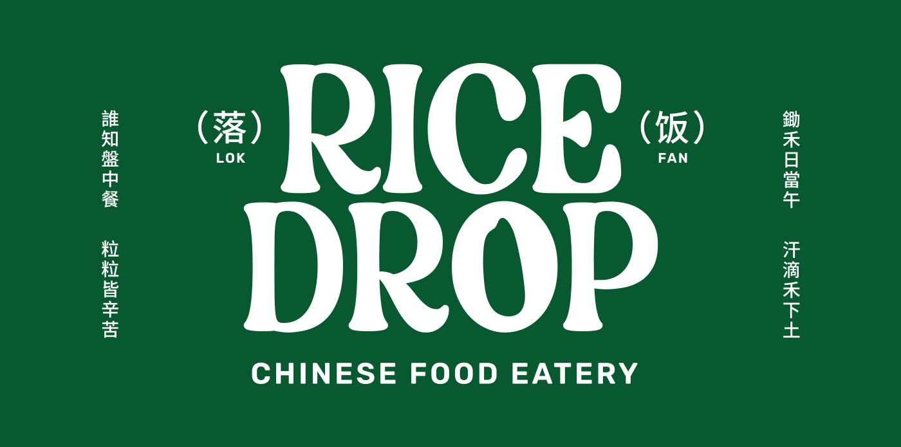

# 🍚🎤 Rice Drop

A self-service kiosk IOS application that seamlessly integrates with Square's Point of Sale (POS) API for Rice Drop. Browse, customize, and place orders with ease and confidence, knowing that transactions are processed securely with Square.

• PROJECT TYPE: Solo Project with Owner Collaboration. My role encompassed the entire project lifecycle, including ideation, wireframing,
  prototyping, visual design, coding, and testing.
  
• DURATION: April 2023 – June 2023

• ROLE: Designer, UI/UX and App Developer (Flutter)

• TOOLS: Photoshop, Figma, Visual Studio Code (VSCode) and Flutter SDK

• RESULT: The self-service checkout kiosk successfully launched and installed in a branch located on Mottingham Road in London.

https://github.com/freemantg/rice_drop/assets/35115094/b8aae9d1-6bc8-4cc2-981f-44f463e985b7

## Table of Contents

- [🌟 Features](#features)
- [🔗 Square POS API Integration](#square-pos-api-integration)
- [🏗️ Architecture](#architecture)
- [🔧 Technical Stack](#technical-stack)
- [🚀 Getting Started](#getting-started)
- [🧪  Unit Testing](#unit-testing)
- [🤝 Contributing](#contributing)
- [📝 License](#license)

## 🌟 Features 

Rice Drop is equipped with features to enhance your dine-in experience:

- **Easy-to-Use On-Brand Interface:** An intuitive, on-brand user interface ensuring easy navigation and use.
- **Square POS API Integration:** Direct integration with the Square POS API for reliable and secure transaction processing.
- **Diverse Menu:** Explore a wide variety of menu items directly from the app.
- **Customizable Orders:** Personalised orders to suit customers' tastes.
- **Order Tracking:** Keep track of orders from preparation to pick up.
- **Secure Payments:** Hassle-free and secure payment processing powered by the Square POS API.

## 🔗 Square POS API Integration

The Point of Sale (POS) API from Square allows Rice Drop to process in-person payments through Square's reliable hardware and software ecosystem. This integration enables secure transactions, a key requirement for any self-service kiosk application, while maintaining PCI compliance standards, shifting the burden of PCI compliance from you to Square.

## 🏗️ Architecture

Rice Drop uses Domain-Driven Design (DDD) and Clean Architecture principles to provide a layered architectural model:

- **Presentation Layer:** This layer houses all user interface components and user interactions. It communicates with the Application layer to handle user inputs.
- **Application Layer:** This layer acts as the intermediary, taking user actions from the Presentation layer and directing them to the appropriate services in the Domain layer.
- **Domain Layer:** The core of Rice Drop, encapsulates all the business logic. It includes models and business rules for orders, menus, and transactions.
- **Infrastructure Layer:** This layer is responsible for all data operations, managing data storage and retrieval through APIs and databases.

## 🔧 Technical Stack

Rice Drop is built with the following technologies:

- **Flutter:** The foundation of Rice Drop, providing a toolkit for building a natively compiled, interactive user interface.
- **Flutter Hooks:** A utility to manage state in an elegant, efficient manner.
- **Riverpod:** Rice Drop's state management solution, ensuring a safe, efficient, and scalable tracking of user orders and interactions.
- **Auto Route:** Automates route generation and manages complex navigation patterns, enhancing user experience across the app.
- **Freezed:** Generates code for union types, facilitating type-safe handling of complex state changes and leading to fewer bugs.
- **Dartz:** Used for robust error handling, wrapping computations that could fail, thus enhancing system resilience.
- **http:** Critical for making API requests to the Square API for payment processing and other interactions. It simplifies the process of fetching data from Square, efficiently handling the necessary HTTP requests for Rice Drop.

## 🚀 Getting Started

1. Install [Flutter](https://flutter.dev/docs/get-started/install) on your local machine.
2. Clone the repository with `git clone https://github.com/rice-drop/rice_drop.git`.
3. Run `flutter packages get` in the root directory to download the project dependencies.
4. Execute `flutter run` to run the project on your device/emulator.

## 🧪 Unit Testing

Rice Drop places a strong emphasis on software quality and maintainability. We utilize extensive unit testing, covering all the major components, to ensure the robustness and reliability of the software. 

To run the tests, use the following command in the project root:

`Flutter Test`

## 🤝 Contributing

We welcome contributions from the community. If you wish to contribute, please refer to our contributing guidelines.

## 📝 License

Rice Drop is licensed under the MIT License. See `LICENSE` for more information.

## Contact 

If you have any questions or suggestions, please reach out to us at <hello@freemantang.dev>. We are always eager to hear from you!
